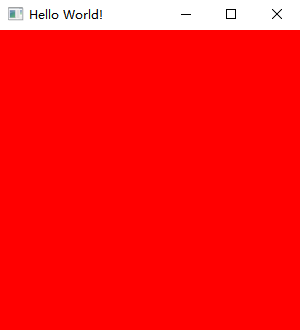

# 准备工作

在开始编写之前，我们需要设置项目。在本教程中，我们使用 _Java 19_。

在项目的构建脚本中添加依赖库。未来，我们可使用 _Customizer_ 生成依赖库。

同时，由于 [_FFM API_](https://openjdk.org/jeps/424) 仍处于预览中，需要在构建脚本中开启预览功能。

```groovy
// Groovy
project.ext.overrunglVer = "0.1.0"
project.ext.overrunglNatives = "natives-windows"
dependencies {
    implementation platform("io.github.over-run:overrungl-bom:$overrunglVer")
    implementation "io.github.over-run:overrungl"
    implementation "io.github.over-run:overrungl-glfw"
    implementation "io.github.over-run:overrungl-opengl"
    implementation "io.github.over-run:overrungl-stb"
    runtimeOnly "io.github.over-run:overrungl-glfw::$overrungNatives"
    runtimeOnly "io.github.over-run:overrungl-stb::$overrungNatives"
}
tasks.withType(JavaCompile).configureEach {
    options.compilerArgs += "--enable-preview"
}

// Kotlin DSL Script
val overrunglVer = "0.1.0"
val overrungNatives = "natives-windows"
dependencies {
    implementation(platform("io.github.over-run:overrungl-bom:$overrunglVer"))
    implementation("io.github.over-run:overrungl")
    implementation("io.github.over-run:overrungl-glfw")
    implementation("io.github.over-run:overrungl-opengl")
    implementation("io.github.over-run:overrungl-stb")
    runtimeOnly("io.github.over-run", "overrungl-glfw", classifier = overrungNatives)
    runtimeOnly("io.github.over-run", "overrungl-stb", classifier = overrungNatives)
}
tasks.withType < JavaCompile > {
    options.compilerArgs.add("--enable-preview")
}
```

如果你以前使用过 [_LWJGL_](https://www.lwjgl.org/)，你会注意到一些模块没有使用本机库（_Natives Library_）。这是因为这些模块使用了系统本机库或使用其他模块进行加载（例如
_OpenGL_ 模块使用 _GLFW_ 模块加载函数），于是我们不用为这些模块构建本机库。

项目加载完成后，使用[此示例](https://github.com/Over-Run/overrungl/wiki/Getting-Started)来创建你的窗口。如果运行成功，你会看到以下红色窗口，如图
1 所示。

|  |
|:---------------------------------------------------:|
|                         图 1                         |

