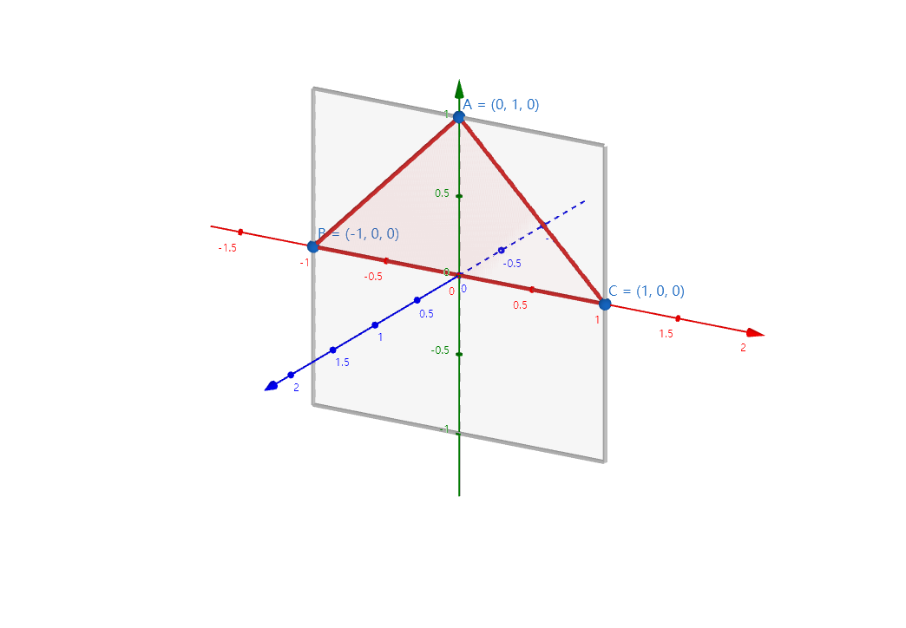
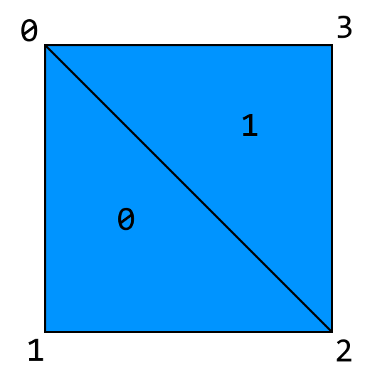

# 渲染

## 前言

上一个章节中，我们成功创建天蓝色窗口。本章节中，我们将添加一个鲜艳的三角形。

## 理论

如图 3.2-1 所示，_OpenGL_ 使用右手坐标系，其中y轴向上，每个**图元**（_Primitive_）的各个顶点按照逆时针排序（也可自行设置）。

|  |
|:----------------------------------------------------------------------:|
|                                图 3.2-1                                 |

灰色矩形为无投影矩阵（_Projection Matrix_）时的默认顶点范围。

### 渲染管线

如图 3.2-2 所示，_OpenGL_ 渲染时经过顶点着色、曲面细分、几何着色、光栅化、片段着色等步骤。我们着重关注顶点、片段着色以及左上角的顶点数据。

|  |
|:---------------------------------------------------------------------:|
|                                图 3.2-2                                |

### 着色器

任何一个 OpenGL 程序都离不开**着色器**（_Shader_）。着色器是渲染的基本程序。一个着色器类似于 C 程序，编译后由显卡驱动执行。

```glsl
#version 330
in vec3 in_position;

void main() {
    gl_Position = vec4(in_position, 1.0);
}
```

这是一段着色器的示例代码。它和普通的 C 代码相似，都含有宏、变量、函数等，只是主函数的返回值为`void`。

### 顶点数据

有了着色器，当然还要有顶点数据。**顶点数据**（_Vertex Data_）定义了一个或多个图元的顶点位置、颜色等，并传递到着色器进行进一步处理。

```c
float[] vertexData = {
    -0.5f, 0.5f, 0.0f,
    -0.5f, -0.5f, 0.0f,
    0.5f, -0.5f, 0.0f,
    0.5f, 0.5f, 0.0f,
};
```

上面的数组定义了一个四边形。然而，_OpenGL_ 不能直接绘制四边形。我们必须手动将其细分为多个三角形，或是使用**元素缓冲对象**（_Element Buffer Object_，简称 _EBO_）。

_EBO_ 定义了绘制图元时使用的顶点。索引从 0 开始。

```c
int[] indexData = {
    0, 1, 2, 2, 3, 0,
};
```

如图 3.2-4 所示，该四边形会分为两个三角形进行绘制。

|  |
|:----------------------------------------------------------:|
|                          图 3.2-4                           |


## 实践

了解以上概念后，我们就能开始编写了。
